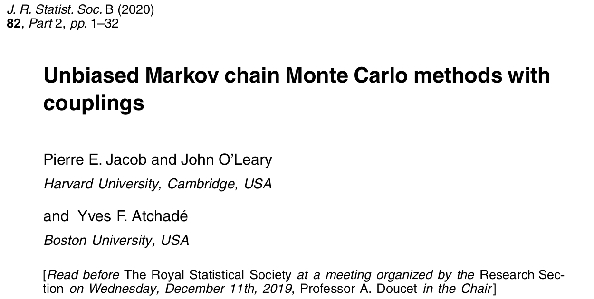

# Introduction

## Read paper



https://arxiv.org/abs/1708.03625

## The problem

* MCMC is widely used in Bayesian computation for generating samples from a posterior distribution
* Since in general we cannot initialise a chain with an exact sample from the target, we rely on asymptotic convergence of the chain to equilibrium, but diagnosing "burn in" and "convergence" is difficult
* The method outlined in the read paper does not solve the "exact sampling" problem, but instead provides a method for removing the bias from any estimates that are produced from the algorithm output, using a pair of coupled chains
* The approach is quite general, and can potentially be applied to many different kinds of MCMC algorithms: Gibbs samplers, Metropolis-Hastings, MALA, HMC, PMCMC, ...
* The read paper concentrates on MH and Gibbs sampling, but there are a bunch of related papers...

## Some related papers

* **Smoothing PFs with couplings**: https://arxiv.org/abs/1701.02002
* **Unbiased HMC with couplings**: https://arxiv.org/abs/1709.00404
* **Unbiased MCMC for intractable targets**: https://arxiv.org/abs/1807.08691
* **Unbiased estimation of log normalizing constants**: https://arxiv.org/abs/1810.01382
* **Unbiased Smoothing using PIMH**: https://arxiv.org/abs/1902.01781
* **Coupling and convergence for HMC**: https://arxiv.org/abs/1805.00452v2

## Bias in MCMC

* We generate a sequence of values $\{X_i|i=0,2,\ldots\}$ from a Markov chain with transition kernel $p(x,x^\star)$ and target equilibrium $\pi(x)$ by first initialising with $X_0 \sim \pi_0(x)$ for some tractable $\pi_0(x)$
* For any functional $h(\cdot)$ of interest, we can estimate $E_\pi[h(X)]$ with the Monte carlo estimate
$$
E_\pi[h(X)] = \int_\mathcal{X} h(x)\pi(x)\,dx \simeq \frac{1}{n} \sum_{i=1}^n h(X_i)
$$
* This estimate should be *consistent*, in that it will converge to the correct expectation as $n\longrightarrow\infty$, but will be **biased** for any finite $n$, due to initialising with $\pi_0(\cdot) \not= \pi(\cdot)$

## Burn-in and parallel chains

* We often attempt to *reduce* the bias by removing some "burn-in", $b$, but this never *completely* removes the bias, and is difficult to choose
$$
E_\pi[h(X)] \simeq \frac{1}{n-b}\sum_{i=b+1}^n h(X_i)
$$
* Asymptotically, as $n\longrightarrow \infty$, the bias becomes negligible, but it's hard to know how big $n$ needs to be, and is even more problematic in the context of multiple parallel chains
* In the parallel chains context, we often consider $c$ chains of fixed length $n$ as $c\longrightarrow\infty$
* Here the bias will be present in *each* chain and will **not** in general become negligible in the $c\longrightarrow\infty$ limit
* Conservative choice of burn-in is also undesirable, since it represents wasted computation on *every* processor

# Coupling Markov chains

## The coupling idea

* The debiasing idea relies on the notion of *coupled* Markov chains
* A pair of coupled chains, $\{(X^{(1)}_t,X^{(2)}_t)|t=1,2,\ldots\}$ each behave *marginally* as if they have initial distribution $\pi_0(x)$ and transition kernel $p(x,x^\star)$
* However, if they are (non-trivially) *coupled*, the two chains are not independent
* Typically the joint transition kernel is chosen so that the chains are encouraged to *coalese*
* The *coupling time*, $\tau$, is given by
$$\tau \equiv \min_t\left\{X^{(1)}_t = X^{(2)}_t\right\}$$
* The coupling is *faithful* if $X^{(1)}_t = X^{(2)}_t\quad \forall t\geq\tau$

## Coupling Metropolis independence samplers

* The Metropolis independence sampler is the simplest MCMC algorithm to couple
* In the single-chain case, after initialising from $\pi_0(x)$, each proposal is generated (independently) from $q(x)$ and accepted with probability $\min\{1,a\}$ where
$$
a = \frac{\pi(x^\star)q(x)}{\pi(x)q(x^\star)}
$$
* This could be done by generating $U\sim U(0,1)$ and accepting if $U<a$
* For *coupled* chains, the *same* proposed value could be used for *both* chains, and the *same* $U$ could be used to accept/reject
* So at each iteration, the use of a common proposed value ensures that there is a finite probability of coalesense, and the use of a common $U$ ensures that any coupling will be faithful

## Example - normal target with cauchy proposals

```{r}
set.seed(4)
n = 40
xm = matrix(0, nrow=n, ncol=2)
x = rcauchy(2)
xm[1, ] = x
for (i in 2:n) {
  xs = rcauchy(1)
  u = runif(1)
  a = dnorm(xs, 0, 0.5)*dcauchy(x) / (
        dnorm(x, 0, 0.5)*dcauchy(xs) )
  x[u < a] = xs
  xm[i, ] = x
  }
```

## Chains

```{r}
plot(ts(xm), plot.type="single", col=c(2,3), lwd=3)
```

## Coupled Metropolis Independence Sampler

```{r}
cmis = function(n, rpi0, dpi, rq, dq) {
    xm = matrix(0, nrow=n, ncol=2)
    x = c(rpi0(), rpi0())
    xm[1, ] = x
    for (i in 2:n) {
        xs = rq()
        u = runif(1)
        a = dpi(xs)*dq(x)/(dpi(x)*dq(xs))
        x[u < a] = xs
        xm[i, ] = x
    }
    xm
}
```

## Example - normal target with Cauchy proposals

```{r}
set.seed(4)
out = cmis(
    40,
    function() rcauchy(1),
    function(x) dnorm(x,0,0.5),
    function() rcauchy(1),
    function(x) dcauchy(x)
	)
```

## Chains

```{r}
plot(ts(out), plot.type="single", col=c(2,3), lwd=3)
```


# Debiasing MCMC

## An unbiased estimate via coupled chains

* Typically we have asymptotic unbiasedness, in that
$$
E_\pi[h(X)] = \lim_{n\rightarrow\infty} E[h(X_n)]
$$
* But by telescoping we have
$$
E[h(X_n)] = E[h(X_0)] + \sum_{t=1}^n \left\{E[h(X_t)] - E[h(X_{t-1})]\right\}
$$
* Now if $\{X_t\}$ and $\{Y_t\}$ are a pair of (coupled) chains with the same marginals, we have
$$
E[h(X_n)] = E[h(X_0)] + \sum_{t=1}^n \left\{E[h(X_t)] - E[h(Y_{t-1})]\right\}
$$

## An unbiased estimate via coupled chains

But then
$$
E_\pi[h(X)] = E[h(X_0)] + \sum_{t=1}^\infty \left\{E[h(X_t)] - E[h(Y_{t-1})]\right\}
$$
and so
$$
E_\pi[h(X)] = E\left[ h(X_0) + \sum_{t=1}^\infty \left\{h(X_t) - h(Y_{t-1})\right\}\right].
$$
In other words,
$$
 h(X_0) + \sum_{t=1}^\infty \left\{h(X_t) - h(Y_{t-1})\right\}
$$
is an unbiased estimate of $E_\pi[h(X)]$

## An unbiased estimate via coupled chains

* Now if $\{X_t\}$ and $\{Y_t\}$ are faithfully coupled *with an offset of 1*, and coupling time $\tau$, then only finitely many terms of the sum will be non-zero. So,
$$
 h(X_0) + \sum_{t=1}^\tau \left\{h(X_t) - h(Y_{t-1})\right\}
$$
will be an (exact) unbiased estimate of $E_\pi[h(X)]$ computable in finite time.
* This is the essence of the debiasing strategy, but this estimate will typically be of high variance, and to implement it we need to be able to couple chains with an offset (of 1)

## Coupling with an offset


## Example: Metropolis independence sampler

```{r}
cmis1 = function(n, rpi0, dpi, rq, dq) {
    xm = matrix(NA, nrow=n+1, ncol=2)
    x = c(rpi0(), rpi0()); xm[1, ] = x
    xs = rq(); u = runif(1)
    a = dpi(xs)*dq(x[1])/(dpi(x[1])*dq(xs))
    if (u < a) x[1] = xs
    xm[2,1] = x[1]
    for (i in 2:n) {
        xs = rq(); u = runif(1)
        a = dpi(xs)*dq(x)/(dpi(x)*dq(xs))
        x[u < a] = xs
        xm[i+1, 1] = x[1]; xm[i, 2] = x[2]
    }
    xm
}
```

## Example: normal target with Cauchy proposals

```{r}
set.seed(4)
out = cmis1(
    40,
    function() rcauchy(1),
    function(x) dnorm(x,0,0.5),
    function() rcauchy(1),
    function(x) dcauchy(x)
)
```

## Chains

```{r}
plot(ts(out), plot.type="single", col=c(2,3), lwd=3)
```

## Time-averaged estimator

## Example: Metropolis independence sampler

## Parallel chains


# Maximal coupling

## Coupling of two densities

## Coupling of MH kernels

## Coupling Gibbs samplers

## Reflection maximal coupling

