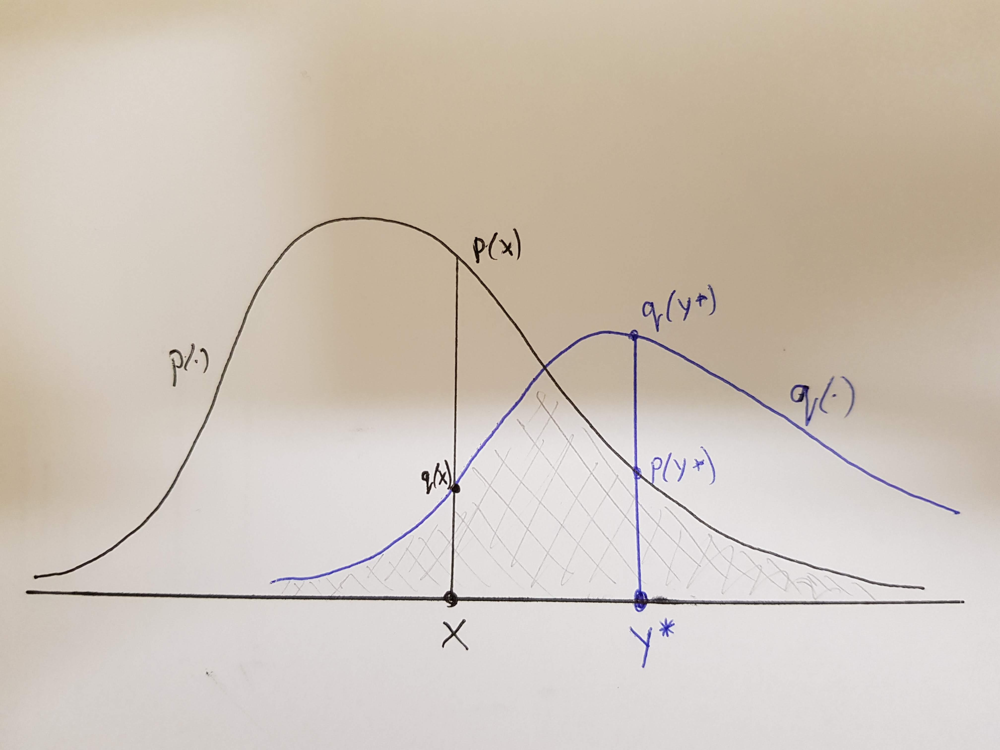

# Introduction

## Read paper


https://arxiv.org/abs/1708.03625

## The problem

* MCMC is widely used in Bayesian computation for generating samples from a posterior distribution
* Since in general we cannot initialise a chain with an exact sample from the target, we rely on asymptotic convergence of the chain to equilibrium, but diagnosing "burn in" and "convergence" is difficult
* The method outlined in the read paper does not solve the "exact sampling" problem, but instead provides a method for removing the bias from any estimates that are produced from the algorithm output, using a pair of coupled chains
* The approach is quite general, and can potentially be applied to many different kinds of MCMC algorithms: Gibbs samplers, Metropolis-Hastings, MALA, HMC, PMCMC, ...
* The read paper concentrates on MH and Gibbs sampling, but there are a bunch of related papers...

## Some related papers

* **Smoothing PFs with couplings**: https://arxiv.org/abs/1701.02002
* **Unbiased HMC with couplings**: https://arxiv.org/abs/1709.00404
* **Unbiased MCMC for intractable targets**: https://arxiv.org/abs/1807.08691
* **Unbiased estimation of log normalizing constants**: https://arxiv.org/abs/1810.01382
* **Unbiased Smoothing using PIMH**: https://arxiv.org/abs/1902.01781
* **Coupling and convergence for HMC**: https://arxiv.org/abs/1805.00452v2

## Bias in MCMC

* We generate a sequence of values $\{X_i|i=0,2,\ldots\}$ from a Markov chain with transition kernel $p(x,x^\star)$ and target equilibrium $\pi(x)$ by first initialising with $X_0 \sim \pi_0(x)$ for some tractable $\pi_0(x)$
* For any functional $h(\cdot)$ of interest, we can estimate $E_\pi[h(X)]$ with the Monte carlo estimate
$$
E_\pi[h(X)] = \int_\mathcal{X} h(x)\pi(x)\,dx \simeq \frac{1}{n} \sum_{i=1}^n h(X_i)
$$
* This estimate should be *consistent*, in that it will converge to the correct expectation as $n\longrightarrow\infty$, but will be **biased** for any finite $n$, due to initialising with $\pi_0(\cdot) \not= \pi(\cdot)$

## Burn-in and parallel chains

* We often attempt to *reduce* the bias by removing some "burn-in", $b$, but this never *completely* removes the bias, and is difficult to choose
$$
E_\pi[h(X)] \simeq \frac{1}{n-b}\sum_{i=b+1}^n h(X_i)
$$
* Asymptotically, as $n\longrightarrow \infty$, the bias becomes negligible, but it's hard to know how big $n$ needs to be, and is even more problematic in the context of multiple parallel chains
* In the parallel chains context, we often consider $c$ chains of fixed length $n$ as $c\longrightarrow\infty$
* Here the bias will be present in *each* chain and will **not** in general become negligible in the $c\longrightarrow\infty$ limit
* Conservative choice of burn-in is also undesirable, since it represents wasted computation on *every* processor

# Coupling Markov chains

## The coupling idea

* The debiasing idea relies on the notion of *coupled* Markov chains
* A pair of coupled chains, $\{(X^{(1)}_t,X^{(2)}_t)|t=1,2,\ldots\}$ each behave *marginally* as if they have initial distribution $\pi_0(x)$ and transition kernel $p(x,x^\star)$
* However, if they are (non-trivially) *coupled*, the two chains are not independent
* Typically the joint transition kernel is chosen so that the chains are encouraged to *coalese*
* The *coupling time*, $\tau$, is given by
$$\tau \equiv \min_t\left\{X^{(1)}_t = X^{(2)}_t\right\}$$
* The coupling is *faithful* if $X^{(1)}_t = X^{(2)}_t\quad \forall t\geq\tau$

## Coupling Metropolis independence samplers

* The Metropolis independence sampler is the simplest MCMC algorithm to couple
* In the single-chain case, after initialising from $\pi_0(x)$, each proposal is generated (independently) from $q(x)$ and accepted with probability $\min\{1,a\}$ where
$$
a = \frac{\pi(x^\star)q(x)}{\pi(x)q(x^\star)}
$$
* This could be done by generating $U\sim U(0,1)$ and accepting if $U<a$
* For *coupled* chains, the *same* proposed value could be used for *both* chains, and the *same* $U$ could be used to accept/reject
* So at each iteration, the use of a common proposed value ensures that there is a finite probability of coalesense, and the use of a common $U$ ensures that any coupling will be faithful

## Example - normal target with cauchy proposals

```{r}
set.seed(4)
n = 40
xm = matrix(0, nrow=n, ncol=2)
x = rcauchy(2)
xm[1, ] = x
for (i in 2:n) {
  xs = rcauchy(1)
  u = runif(1)
  a = dnorm(xs, 0, 0.5)*dcauchy(x) / (
        dnorm(x, 0, 0.5)*dcauchy(xs) )
  x[u < a] = xs
  xm[i, ] = x
  }
```

## Chains

```{r}
plot(ts(xm), plot.type="single", col=c(2,3), lwd=3)
```

## Coupled Metropolis Independence Sampler

```{r}
cmis = function(n, rpi0, dpi, rq, dq) {
    xm = matrix(0, nrow=n, ncol=2)
    x = c(rpi0(), rpi0())
    xm[1, ] = x
    for (i in 2:n) {
        xs = rq()
        u = runif(1)
        a = dpi(xs)*dq(x)/(dpi(x)*dq(xs))
        x[u < a] = xs
        xm[i, ] = x
    }
    xm
}
```

## Example - normal target with Cauchy proposals

```{r}
set.seed(4)
out = cmis(
    40,
    function() rcauchy(1),
    function(x) dnorm(x,0,0.5),
    function() rcauchy(1),
    function(x) dcauchy(x)
	)
```

## Chains

```{r}
plot(ts(out), plot.type="single", col=c(2,3), lwd=3)
```


# Debiasing MCMC

## An unbiased estimate via coupled chains

* Typically we have asymptotic unbiasedness, in that
$$
E_\pi[h(X)] = \lim_{n\rightarrow\infty} E[h(X_n)]
$$
* But by telescoping we have
$$
E[h(X_n)] = E[h(X_0)] + \sum_{t=1}^n \left\{E[h(X_t)] - E[h(X_{t-1})]\right\}
$$
* Now if $\{X_t\}$ and $\{Y_t\}$ are a pair of (coupled) chains with the same marginals, we have
$$
E[h(X_n)] = E[h(X_0)] + \sum_{t=1}^n \left\{E[h(X_t)] - E[h(Y_{t-1})]\right\}
$$

## An unbiased estimate via coupled chains

But then
$$
E_\pi[h(X)] = E[h(X_0)] + \sum_{t=1}^\infty \left\{E[h(X_t)] - E[h(Y_{t-1})]\right\}
$$
and so
$$
E_\pi[h(X)] = E\left[ h(X_0) + \sum_{t=1}^\infty \left\{h(X_t) - h(Y_{t-1})\right\}\right].
$$
In other words,
$$
 h(X_0) + \sum_{t=1}^\infty \left\{h(X_t) - h(Y_{t-1})\right\}
$$
is an unbiased estimate of $E_\pi[h(X)]$

## An unbiased estimate via coupled chains

* Now if $\{X_t\}$ and $\{Y_t\}$ are faithfully coupled *with an offset of 1*, and coupling time $\tau$, then only finitely many terms of the sum will be non-zero. So,
$$
 h(X_0) + \sum_{t=1}^{\tau-1} \left\{h(X_t) - h(Y_{t-1})\right\}
$$
will be an (exact) unbiased estimate of $E_\pi[h(X)]$ computable in finite time.
* This is the essence of the debiasing strategy, but this estimate will typically be of high variance, and to implement it we need to be able to couple chains with an offset (of 1)

## Coupling with an offset

The debiasing trick requires a pair of Markov chains to be coupled with an offset. Then, marginally, $X_t$ and $Y_t$ have the same distribution, but it is $X_t$ and $Y_{t-1}$ that are coupled. We do this as follows:

* Draw $X_0$ and $Y_0$ independently from $\pi_0$
* Draw $X_1$ from the relevant MCMC kernel
* For $t\geq 1$, draw the pair $(X_{t+1},Y_t)$ conditionally on $(X_t,Y_{t-1})$ using a coupled kernel, as previously discussed
* Then if the coupling time is $\tau$, we will have that $X_t = Y_{t-1}\quad\forall t\geq\tau$

## Example: Metropolis independence sampler

```{r}
cmis1 = function(n, rpi0, dpi, rq, dq) {
    xm = matrix(NA, nrow=n+1, ncol=2)
    x = c(rpi0(), rpi0()); xm[1, ] = x
    xs = rq(); u = runif(1)
    a = dpi(xs)*dq(x[1])/(dpi(x[1])*dq(xs))
    if (u < a) x[1] = xs
    xm[2,1] = x[1]
    for (i in 2:n) {
        xs = rq(); u = runif(1)
        a = dpi(xs)*dq(x)/(dpi(x)*dq(xs))
        x[u < a] = xs
        xm[i+1, 1] = x[1]; xm[i, 2] = x[2]
    }
    xm
}
```

## Example: normal target with Cauchy proposals

```{r}
set.seed(4)
out = cmis1(
    40,
    function() rcauchy(1),
    function(x) dnorm(x,0,0.5),
    function() rcauchy(1),
    function(x) dcauchy(x)
)
```

## Chains

```{r}
plot(ts(out), plot.type="single", col=c(2,3), lwd=3)
```

## Time-averaged estimator

We have seen how to use the output of a pair of coupled chains to construct a random quantity representing an unbiased estimate of an expectation of interest. However, this will typically have high variance, for two reasons.

1. The trajectory used for debiasing includes the "burn-in" phase where bias is high
2. The estimator is essentially a debiased version of a *single* value from the chain, $h(X_0)$

The first issue is easily fixed by ignoring a burn-in period of $k\geq 0$, and telescoping starting from $h(X_k)$, to produce the unbiased estimator:
$$
H_k(X,Y) \equiv h(X_k) + \sum_{t=k+1}^{\tau-1} \left\{h(X_t) - h(Y_{t-1})\right\}
$$

## Time-averaged estimator

To deal with the second issue, if we would like to base our inferences as an average over a chain of length $m\geq k$, we can run coupled chains for $\max\{m,\tau\}$ iterations, computing the unbiased estimators $H_l(X,Y)$ for all $l\in\{k,\ldots,m\}$, and average them:
$$
H_{k:m}(X,Y) \equiv \frac{1}{m-k+1}\sum_{l=k}^m H_l(X,Y)
$$
Expanding the definition of $H_l(X,Y)$ and re-arranging the terms gives (after a little algebra):
$$
H_{k:m}(X,Y) = \frac{1}{m-k+1}\sum_{t=k}^m h(X_t) + \qquad\qquad\mbox{}$$
$$
\mbox{}\qquad\qquad\qquad \sum_{t=k+1}^{\tau-1}\min\left(1,\frac{t-k}{m-k+1}\right)\{h(X_t)-h(Y_{t-1})\}
$$
$$
\equiv \text{MCMC}_{k:m} + \text{BC}_{k:m}
$$

## Parallel chains

* One of the main motivations for obtaining unbiased estimation of posterior expectations is to fix one of the issues with parallel chains MCMC
* We would like to run many chains independently on different processors and then pool results in some way
* In this case any bias in the chains will not "average out" across multiple processors, since there will be non-negligable bias in every chain
* Unbiased estimators can be safely averaged to get new unbiased estimators with reduced variance
* However, the debiasing doesn't actually eliminate burn-in - it just corrects for it, so you still have repeated burn-in, limiting the scalability of the parallel chains approach

# Maximal coupling

## Coupling of two densities

* We have seen how to couple Metropolis independence samplers, but to couple other Markov chains, we need a more general strategy to couple Markov kernels
* We begin by thinking about how to couple two probability densities, $p(x)$ and $q(x)$
* That is, we want to sample a pair $(X,Y)$ s.t. marginally $X\sim p(\cdot)$ and $Y\sim q(\cdot)$, but that jointly they are coupled to maximise $P(X=Y)$
* This can be accomplished using a simple rejection sampler:
1. Sample $X\sim p(\cdot)$ and $W|X \sim U(0,p(X))$. If $W\leq q(X)$, output $(X,X)$, otherwise:
2. Sample $Y^\star\sim q(\cdot)$ and $W^\star|Y^\star \sim U(0,q(Y^\star))$ until $W^\star > p(Y^\star)$, then output $(X,Y^\star)$

## Proof by picture!



## Coupling in R

```{r}
rcouple = function(rp, dp, rq, dq) {
    x = rp()
    w = runif(1,0,dp(x))
    if (w < dq(x))
        return(c(x,x))
    else repeat {
        ys = rq()
        ws = runif(1,0,dq(ys))
        if (ws > dp(ys))
            return(c(x,ys))
        }
    }
```

## Example: coupling two different normals

```{r}
coupled = function()
    rcouple(
        function() rnorm(1,0,1),
        function(x) dnorm(x,0,1),
        function() rnorm(1,1,2),
        function(x) dnorm(x,1,2)
        )
		
set.seed(1)
xm = t(sapply(1:10000, function(x) coupled()))
```

## Plotting code

```{r}
doPlot = function(xm) {
    op = par(mfrow=c(2,2))
    hist(xm[,2], 20, xlab="N(1,4)", col=2,
		main="First marginal")
    plot(xm, pch=19, col=3, xlab="N(0,1)",
		ylab="N(1,4)", main="Joint density")
    curve(dnorm(x,0,1), -6, 8, col=4, lwd=2,
		ylab="Density", main="True marginals")
	curve(dnorm(x,1,2), col=2, lwd=2, add=TRUE)
    hist(xm[,1], 20, xlab="N(0,1)", col=4,
		main="Second marginal")
    par(op)
}
```

## Plots

```{r}
doPlot(xm)
```

## Coupling of Metropolis-Hastings kernels

Now we can couple densities, we can couple MH kernels, allowing us to easily adapt the coupling method we used for Metropolis independence samplers to arbitrary MH proposals

* For a single chain, at time $t$ we sample $X^\star\sim q(X_t,\cdot)$ and $U\sim U(0,1)$ and accept if
$$
U < \frac{\pi(X^\star)q(X^\star,X_t)}{\pi(X_t)q(X_t,X^\star)}
$$
* For a pair of coupled chains (with an offset of 1), we update $(X_t,Y_{t-1})$ by sampling $(X^\star,Y^\star)$ from a maximal coupling of $q(X_t,\cdot)$ and $q(Y_{t-1},\cdot)$, and use the same $U$ to accept/reject to two resulting proposals
* The maximal coupling ensures a finite probability of coupling, and the same $U$ ensures any coupling will be faithful


---

```{r size="tiny"}
cmh1 = function(n, rpi0, dpi, rq, dq) {
    xm = matrix(NA, nrow=n+1, ncol=2)
    x = c(rpi0(), rpi0()); xm[1, ] = x
    xs = rq(x[1]); u = runif(1)
    a = dpi(xs)*dq(xs,x[1])/(dpi(x[1])*dq(x[1],xs))
    if (u < a) x[1] = xs
    xm[2,1] = x[1]
    for (i in 2:n) {
		xs = rcouple(
          function() rq(x[1]), function(xp) dq(x[1],xp),
          function() rq(x[2]), function(xp) dq(x[2],xp) )
        u = runif(1)
        a = dpi(xs)*dq(xs,x)/(dpi(x)*dq(x,xs))
        x[u < a] = xs[u < a]
        xm[i+1, 1] = x[1]; xm[i, 2] = x[2] }
    xm
}
```

## Example: normal target with normal proposals

```{r}
set.seed(3)

out = cmh1(
    120,
    function() rcauchy(1),
    function(x) dnorm(x,0,1),
    function(x) rnorm(1,x,0.1),
    function(x,xs) dnorm(xs,x,0.1)
)
```

## Plots

```{r}
plot(ts(out), plot.type="single", col=c(2,3), lwd=3)
```


## Coupling Gibbs samplers


## Reflection maximal coupling ???

# Summary

## Summary

Wrap-up here...
